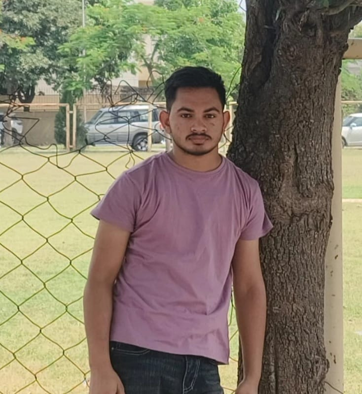

# 👋 Hey! I'm Vinay Sharma

<p align="center">
  
</p>

<p align="center">
  
</p>

---

## 🧑‍💻 About Me

🎓 **B.Tech CSE — Artificial Intelligence & Machine Learning**

💻 Learning and practicing **C, C++ & Python**

📊 Exploring **Data Science & Data Analysis**

🤖 Learning **Machine Learning & AI**

🧠 Practicing **DSA & Problem Solving**

🛠️ Building projects to improve my development skills

🚀 Working towards becoming an **AI/ML Engineer**

---

## 🏢 Training

### Sonalika International Tractors Ltd.

**Industrial Training**

Completed industrial training at **Sonalika International Tractors Ltd.**, gaining exposure to a professional industrial environment and practical understanding of technical and organizational workflows.

### 🎯 Training Highlights

* 🏭 Professional industrial environment
* 🔧 Technical and operational exposure
* 📚 Practical learning
* 👨‍💻 Professional work culture
* 🎯 Understanding real-world workflows

---

## ⚡ Programming Languages

<p align="center">
  
</p>

<p align="center">
  
  
  
  
  
  
</p>

---

## 🛠️ Development Tools

<p align="center">
  
</p>

<p align="center">
  
  
  
  
  
  
</p>

**Development:** `Jupyter Notebook` • `Spyder` • `VS Code` • `Git` • `GitHub`

---

## 📊 Data Science & Visualization

<p align="center">
  
  
  
  
  
  
  
  
    <p align="center">
</p>

**Libraries:** `NumPy` • `Pandas` • `Matplotlib` • `Seaborn` • `Scikit-learn`

---

## 🚀 My Projects
## 🧬 Featured Project — OncoVision AI

### Multi-Cancer Detection & Prediction using ML & Deep Learning

OncoVision AI is an educational AI application that combines traditional Machine Learning and Deep Learning for multi-cancer image and tabular-data classification.

**🩺 Breast Cancer**
- RBF SVM
- Tabular medical features
- Feature preprocessing and scaling

**🔬 Skin Cancer**
- ResNet18 CNN
- Transfer Learning
- Fine-Tuning
- Image classification

**🫁 Lung Cancer**
- ResNet18 CNN
- Transfer Learning & Fine-Tuning
- 4-class classification
- Grad-CAM explainability

### 🛠️ Tech Stack

`Python` `PyTorch` `Torchvision` `Scikit-learn` `Pandas` `NumPy` `Matplotlib` `Streamlit`

### 📸 Project Preview


### 🔥 Grad-CAM


### 🔗 Project

[](https://github.com/sharmavinay9932-cse/oncovision-ai)

> ⚠️ Educational/research project only. Predictions are not medical diagnoses.

**Developed by Vinay Sharma**

## 🚀 Featured Project — Customer Churn Predictor & AI Retention Assistant

### 📊 Customer Churn Prediction + Generative AI

An end-to-end **Machine Learning + Generative AI** project that predicts customer churn probability and provides AI-powered retention recommendations.

🔗 **[View Project Repository](https://github.com/sharmavinay9932-cse/customer-churn-predictor.git)**  
🌐 **[Live Demo](https://customer-churn-predictor-fzzrhb2hilxxgxskgvkx8e.streamlit.app/)**

### 🔥 Highlights

- 📊 Exploratory Data Analysis (EDA)
- 🧹 Data Cleaning & Preprocessing
- ⚙️ Feature Engineering
- 🎯 Mutual Information-based Feature Selection
- 🤖 Multiple ML Classification Models
- 📈 Model Evaluation using Accuracy, Precision, Recall, F1 & ROC-AUC
- 🔮 Customer Churn Probability Prediction
- 🖥️ Interactive Streamlit Dashboard
- 📈 Customer Analytics
- 🧠 Generative AI Retention Assistant
- 💡 AI-powered Risk Explanation & Retention Strategies
- ☁️ Streamlit Cloud Deployment

### 🛠️ Tech Stack

`Python` `NumPy` `Pandas` `Matplotlib` `Seaborn`  
`Scikit-learn` `Joblib` `Streamlit` `OpenAI API`  
`Git` `GitHub`

### 🧠 Architecture

```text
Customer Data
      ↓
EDA & Data Cleaning
      ↓
Feature Engineering
      ↓
Feature Selection
      ↓
ML Model
      ↓
Churn Prediction
      ↓
Churn Probability
      ↓
Generative AI
      ↓
Risk Explanation
      ↓
Retention Recommendations


## ❤️ Heart Disease Prediction

A Machine Learning classification project that predicts the likelihood of heart disease using patient health-related features.

### 🔍 Project Workflow

* 📊 Exploratory Data Analysis (EDA)
* 🧹 Data Cleaning
* ⚙️ Data Preprocessing
* 🔧 Feature Engineering
* 🎯 Feature Selection
* 🤖 Model Training
* 📈 Model Evaluation
* 💾 Model Serialization using Pickle
* 🌐 Streamlit Deployment

### 🤖 Model

**K-Nearest Neighbors (KNN)**

The trained model is saved using Pickle along with the preprocessing objects required for prediction.

### 🛠️ Tech Stack

`Python` • `NumPy` • `Pandas` • `Matplotlib` • `Seaborn` • `Scikit-learn` • `Pickle` • `Streamlit`

### 📁 Project Files

```text
Heart-Disease-ML/
│
├── app.py
├── HeartdiseaseFinal.ipynb
├── knn_heart_model.pkl
├── heart_scaler.pkl
├── heart_columns.pkl
├── requirements.txt
└── README.md
```

### 🌐 Deployment

The model is deployed using **Streamlit**, allowing users to enter patient information and receive a prediction through an interactive web interface.

### 📌 Disclaimer

This project is intended for educational and Machine Learning demonstration purposes only. It should not be used as a substitute for professional medical advice or diagnosis.

## 🚜 Tractor Sales Prediction

Machine Learning regression project for predicting monthly tractor sales using historical sales data.

**What I worked on:**

* 📊 EDA & data preprocessing
* ⚙️ Time-based feature engineering
* 📈 Lag & rolling-average features
* 🤖 Linear Regression model
* 📏 MAE, RMSE & R² evaluation
* 💾 Model serialization with Pickle
* 🌐 Streamlit deployment

**Tech:** `Python` `NumPy` `Pandas` `Matplotlib` `Seaborn` `Scikit-learn` `Pickle` `Streamlit`

**Project:** [🚜 Tractor Sales Prediction](https://github.com/sharmavinay9932-cse/tractor-price-predictor/tree/main)

### 🚀 Space Shooter Pro

🎮 A 2D space shooting game developed using **Python and Pygame**.

**Features:**

* 🚀 Player movement
* 🔫 Shooting system
* 👾 Enemy spawning
* 💥 Collision detection
* 🏆 Score system
* ❤️ Health system
* 💀 Game Over system

---

### 🤖 Rule-Based Chatbot

💬 A simple Python chatbot that uses **predefined rules and keyword matching** to interact with users.

**Technology:** `Python`

---

### 📝 Text Editor

📄 A lightweight text editor application built using **Python and Tkinter**.

**Features:**

* 📄 Create files
* 📂 Open files
* ✏️ Edit text
* 💾 Save files

---

### 📊 Python Data Science Practice

📈 A learning repository containing practice with:

`NumPy` • `Pandas` • `Matplotlib` • `Seaborn`

---

## 📚 Currently Learning

<p align="center">
  
</p>

---

## 🎯 My Learning Roadmap

```text
💻 C
   ↓
🔥 C++
   ↓
🐍 Python
   ↓
🔢 NumPy + 🐼 Pandas
   ↓
📊 Data Visualization
   ↓
📚 Statistics
   ↓
🤖 Machine Learning
   ↓
🧠 Deep Learning
   ↓
🚀 AI/ML Projects
```

---

## 💡 What I'm Working On

```text
🐍 Strengthening Python
        ↓
📊 Data Analysis
        ↓
🤖 Machine Learning
        ↓
🧠 Artificial Intelligence
        ↓
🚀 Real-World Projects
```


## 💻 Most Used Languages

<p align="center">
  
</p>

---

## 🔥 GitHub Streak

<p align="center">
  
</p>

---

## 🐍 Contribution Snake

<p align="center">
  
</p>

---

## 🎯 My Goals

* 🚀 Become a strong **Python Developer**
* 🧠 Master **Data Structures & Algorithms**
* 📊 Build strong **Data Science fundamentals**
* 🤖 Become proficient in **Machine Learning**
* 🧠 Explore **Deep Learning & AI**
* 💼 Gain internship and placement experience
* 🛠️ Build real-world AI/ML projects

---

## 📬 Contact Me

<p align="center">
  <a href="https://github.com/sharmavinay9932-cse">
    
  </a>
  <a href="mailto:sharmavinay9932@gmail.com">
    
  </a>
</p>

<p align="center">
  📧 <b>Email:</b> sharmavinay9932@gmail.com
</p>

---

<p align="center">
  
</p>

<h3 align="center">
  🚀 Learn • Build • Fail • Improve • Repeat
</h3>

<p align="center">
  ⭐ Thanks for visiting my profile!
</p>
